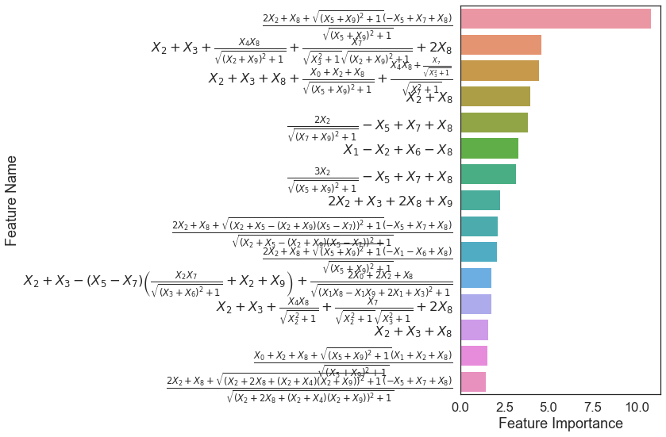
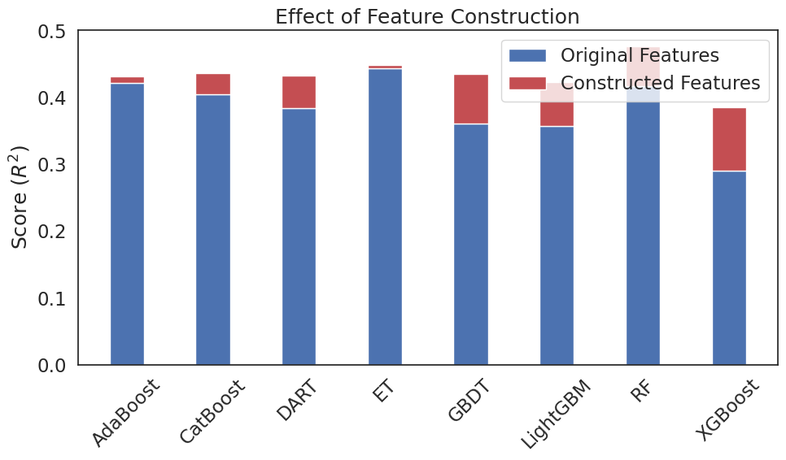

## 任务描述

在传统的机器学习领域，构建鲁棒且有价值的特征可以显著改善最终模型的性能。尤其是随着深度学习的发展，特征自动构建已经不再是一件新鲜事。但是，在传统机器学习领域，尤其是数据量不足的时候，基于深度学习的特征构建算法往往难以取得满意的效果。此外，深度学习的黑盒特性也影响了深度学习算法在金融和医疗领域的应用。因此，本文旨在探索一种新的基于演化算法的自动特征构建算法（Evolutionary
Forest）在特征工程方面的效果。为了简单起见，我选择了scikit-learn包中的一个问题作为案例研究问题。这项任务被称为“diabetes”，其目标是预测一年后该疾病的进展情况。

## 软件包安装

首先我们需要安装自动特征构建框架Evolutionary Forest，目前该框架可以直接从PIP进行安装，也可以从GitHub上手动下载源码安装。

```bash
pip install -U evolutionary_forest
```

或

```
git clone https://github.com/zhenlingcn/EvolutionaryForest.git
cd EvolutionaryForest
pip install -e .
```

## 初步验证

安装完成后，就可以开始模型训练了，我们将数据分成训练集和测试集，分别训练随机森林和Evolutionary Forest，并在测试集上进行测试。

```python
import random

import numpy as np
from catboost import CatBoostRegressor
from lightgbm import LGBMRegressor
from sklearn.datasets import load_diabetes
from sklearn.ensemble import ExtraTreesRegressor, AdaBoostRegressor, GradientBoostingRegressor, RandomForestRegressor
from sklearn.metrics import r2_score
from sklearn.model_selection import train_test_split
from xgboost import XGBRegressor

from evolutionary_forest.forest import EvolutionaryForestRegressor
from evolutionary_forest.utils import get_feature_importance, plot_feature_importance, feature_append

random.seed(0)
np.random.seed(0)

# Load Dataset
X, y = load_diabetes(return_X_y=True)
x_train, x_test, y_train, y_test = train_test_split(X, y, test_size=0.2, random_state=0)

# Train Random Forest
r = RandomForestRegressor()
r.fit(x_train, y_train)
print('随机森林R2分数', r2_score(y_test, r.predict(x_test)))

# Train Evolutionary Forest
r = EvolutionaryForestRegressor(max_height=3, normalize=True, select='AutomaticLexicase',
                                gene_num=10, boost_size=100, n_gen=20, n_pop=200, cross_pb=1,
                                base_learner='Random-DT', verbose=True, n_process=64)
r.fit(x_train, y_train)
print('演化森林R2分数', r2_score(y_test, r.predict(x_test)))
```

输出结果：

    随机森林R2分数 0.26491330931789137
    演化森林R2分数 0.2793594493000817

## 特征重要性可视化

基于上述结果，我们可以看到Evolutionary
Forest优于传统的随机森林算法。然而，我们不应该仅仅满足于拥有一个更好的模型。事实上，该框架的一个更重要的目标是获得更多优质的可解释特征，从而提高主流机器学习模型的性能。因此，我们可以基于impurity
reduction计算特征的重要性，然后根据这些重要性分数对所有特征进行排序。为了清晰起见，目前只显示前15个最重要的特征。

```python
feature_importance_dict = get_feature_importance(r)
plot_feature_importance(feature_importance_dict)
```



在创建特征重要性图之后，我们可以尝试利用这些有用的特征，并探究这些特征是否能够真正地改进现有模型的性能。为了简单起见，我们放弃使用原来的特征，只保留构造好的特征。

```python
# Synthesize new features
code_importance_dict = get_feature_importance(r, simple_version=False)
new_train = feature_append(r, r.x_scaler.transform(x_train),
                           list(code_importance_dict.keys())[:len(code_importance_dict) // 2],
                           only_new_features=True)
new_test = feature_append(r, r.x_scaler.transform(x_test),
                          list(code_importance_dict.keys())[:len(code_importance_dict) // 2],
                          only_new_features=True)
# Train a new model based on synthesized features
new_r = RandomForestRegressor()
new_r.fit(new_train, y_train)
print('基于新特征的随机森林 R2分数', r2_score(y_test, new_r.predict(new_test)))
```

输出结果：

    基于新特征的随机森林 R2分数: 0.2868234236333319

从结果中可以看出，所构建的特征确实能够带来性能的提高，说明了所构建的特征的有效性。然而，一个更有趣的问题是，这些特征是否只能用于这个随机森林模型呢，或者说它们是否也可以应用于其他机器学习模型呢？因此，在下一节中，我们将尝试看看这些特征是否可以用来改善现有的最先进的机器学习算法的性能。

## 高阶特征在主流机器学习算法上的效果
```python
from pathos.multiprocessing import ProcessPool
import pandas as pd
from sklearn.model_selection import KFold

def single_fold_training(train_index, test_index):
    regressor_list = ['RF', 'ET', 'AdaBoost', 'GBDT', 'DART', 'XGBoost', 'LightGBM', 'CatBoost']
    x_train, y_train, x_test, y_test = X[train_index], y[train_index], X[test_index], y[test_index]
    # Retrain an evolutionary forest
    r = EvolutionaryForestRegressor(max_height=3, normalize=True, select='AutomaticLexicase',
                                    gene_num=10, boost_size=100, n_gen=20, n_pop=200, cross_pb=1,
                                    base_learner='Random-DT', verbose=True, n_process=64)
    r.fit(x_train, y_train)
    # Testing data should also be normalized!
    x_train, x_test = r.x_scaler.transform(x_train), r.x_scaler.transform(x_test)
    # Synthesize new features
    code_importance_dict = get_feature_importance(r, simple_version=False)
    new_train = feature_append(r, x_train, list(code_importance_dict.keys())[:len(code_importance_dict.keys()) // 2],
                               only_new_features=True)
    new_test = feature_append(r, x_test, list(code_importance_dict.keys())[:len(code_importance_dict.keys()) // 2],
                              only_new_features=True)
    regressor_dict = {
        'RF': RandomForestRegressor(n_estimators=200, n_jobs=-1),
        'ET': ExtraTreesRegressor(n_estimators=200, n_jobs=-1),
        'AdaBoost': AdaBoostRegressor(n_estimators=200),
        'GBDT': GradientBoostingRegressor(n_estimators=200),
        'DART': LGBMRegressor(n_jobs=1, n_estimators=200, boosting_type='dart',
                              xgboost_dart_mode=True),
        'XGBoost': XGBRegressor(n_jobs=1, n_estimators=200),
        'LightGBM': LGBMRegressor(n_jobs=1, n_estimators=200),
        'CatBoost': CatBoostRegressor(n_estimators=200, thread_count=1,
                                      verbose=False, allow_writing_files=False),
    }
    scores_base = []
    scores_enhanced = []
    for regr in regressor_list:
        # Training on original features
        regressor = regressor_dict[regr]
        regressor.fit(x_train, y_train)
        score = r2_score(y_test, regressor.predict(x_test))
        base_score = (regr, score)
        scores_base.append(base_score)
        # Training on new features
        regressor.fit(new_train, y_train)
        score = r2_score(y_test, regressor.predict(new_test))
        enhanced_score = (regr, score)
        scores_enhanced.append(enhanced_score)
    return scores_base, scores_enhanced


p = ProcessPool()
cv = KFold(n_splits=10, shuffle=True, random_state=0)
scores_base = []
scores_enhanced = []
# Cross-validation through a multiprocess way
m = p.map(lambda x: single_fold_training(*x), cv.split(X, y))
for scores_base_tmp, scores_tmp in m:
    scores_base.extend(scores_base_tmp)
    scores_enhanced.extend(scores_tmp)

# Score aggregation
base_frame = pd.DataFrame(scores_base, columns=['algorithm', 'score'])
base_frame['score'] = pd.to_numeric(base_frame['score'])
print(base_frame.groupby(['algorithm']).mean())
improved_frame = pd.DataFrame(scores_enhanced, columns=['algorithm', 'score'])
improved_frame['score'] = pd.to_numeric(improved_frame['score'])
print(improved_frame.groupby(['algorithm']).mean())
base_score = base_frame.groupby(['algorithm']).mean()
improved_score = improved_frame.groupby(['algorithm']).mean()
print(improved_score - base_score)
```

输出结果：

    预测分数提升：
    AdaBoost   0.009783
    CatBoost   0.031601
    DART       0.048100
    ET         0.004069
    GBDT       0.074935
    LightGBM   0.065691
    RF         0.060430
    XGBoost    0.094114

基于上述结果，我们可以得出结论，自动构建的特征提高了所有模型的性能。尤其值得注意的是，自动构建的特征大幅度改进了XGBoost和随机森林的性能。基于这个实验的结果，我们可以得出结论，Evolutionary
Forest不仅是一种有效的回归模型构建方法，可以构建一个强大的回归模型，同时也可以作为一个自动特征生成方法，用于生成可解释的特征以及提高现有机器学习系统的性能。自动构建的特征所带来的性能提升如下图所示。

```python
import matplotlib.pyplot as plt
import seaborn as sns

sns.set(style="white", font_scale=1.5)
width = 0.4
fig, ax = plt.subplots(figsize=(10, 6))
ax.bar(base_score.index, base_score['score'], width, label='Original Features')
difference = improved_score['score'] - base_score['score']
print(np.where(difference > 0, 'g', 'y'))
ax.bar(base_score.index, difference, width, bottom=base_score['score'],
       label='Constructed Features',
       color=np.where(difference > 0, 'r', 'y'))
ax.set_ylabel('Score ($R^2$)')
ax.set_title('Effect of Feature Construction')
ax.legend()
plt.xticks(rotation=45)
plt.tight_layout()
plt.show()
```



## 总结
基于这个简单的例子，我们验证了Evolutionary
Forest能够发现有用的特征，并可以用来改进现有的机器学习系统。需要注意的是，尽管发现的特征提高了验证得分，然而依然可能会有过拟合的风险。因此，在实际应用中，我们依然需要对生成的特征进行仔细审查，以确保新构建模型的有效性。

